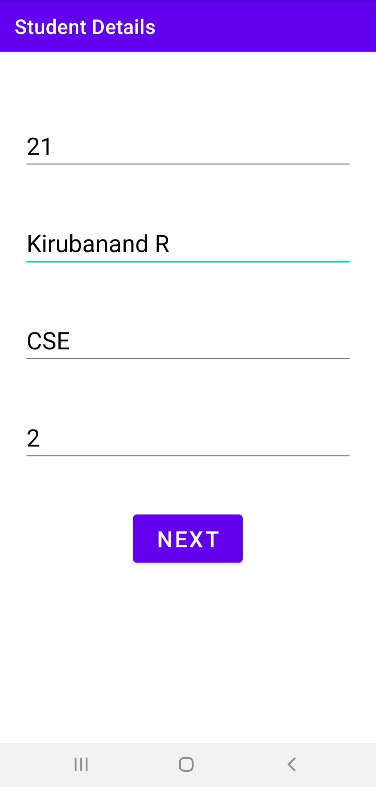
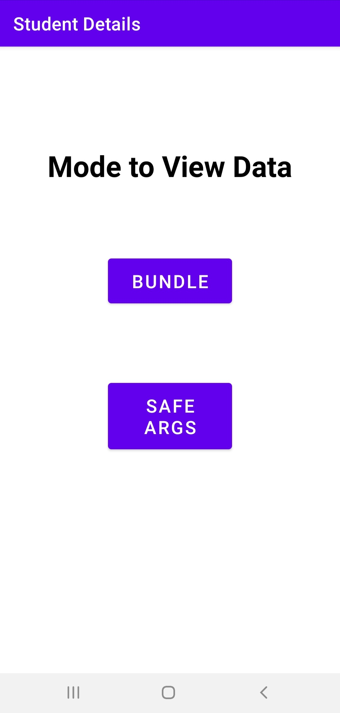
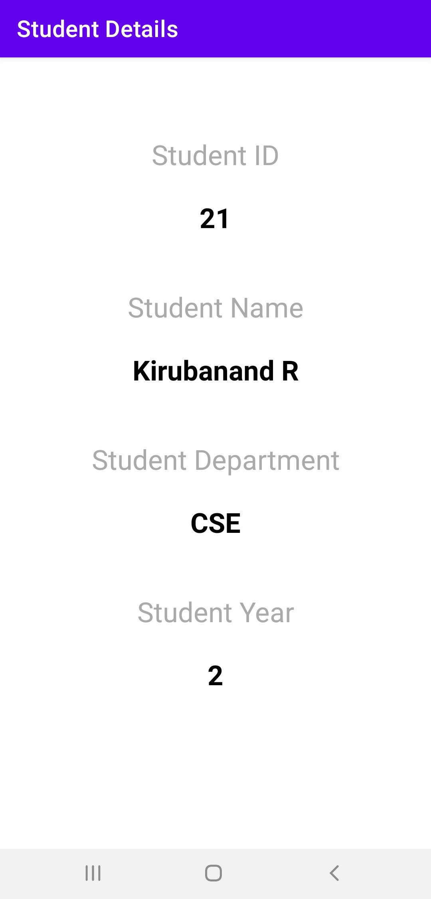

# Student-Details
A simple app using Navigation Components to input few data and display them. The data is passed between fragments using Bundles (old school way) and SafeArgs (safe and modern way).

### Screenshots of the App
<table>
  <tr>
    <td>  </td>
    <td>  </td>
    <td>  </td>
  </tr>
</table>
